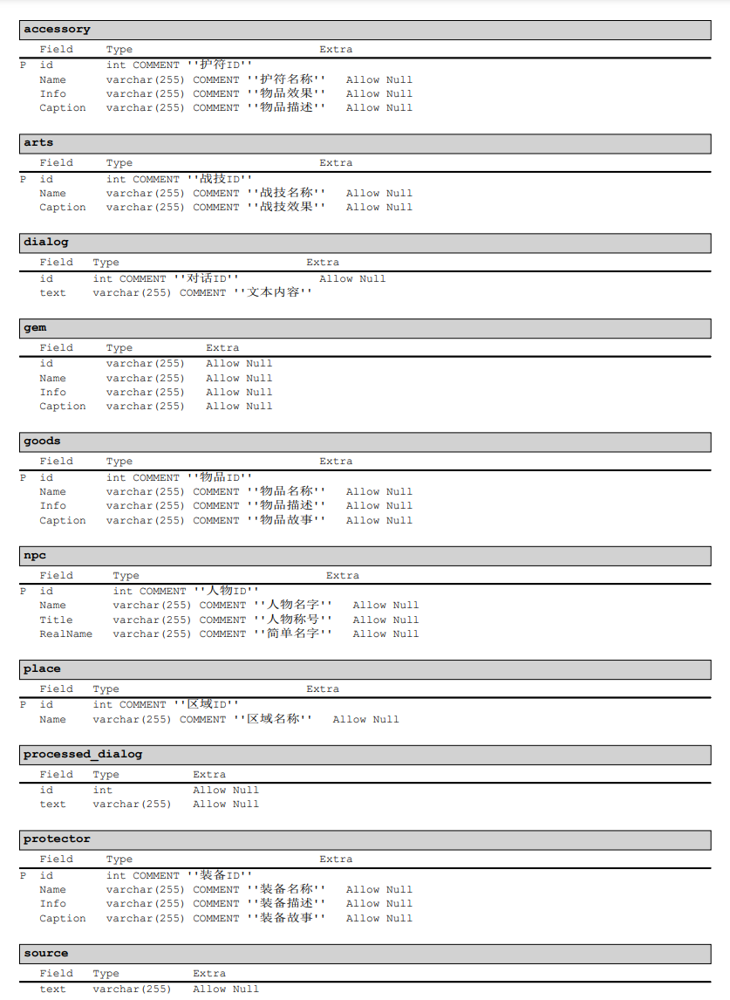
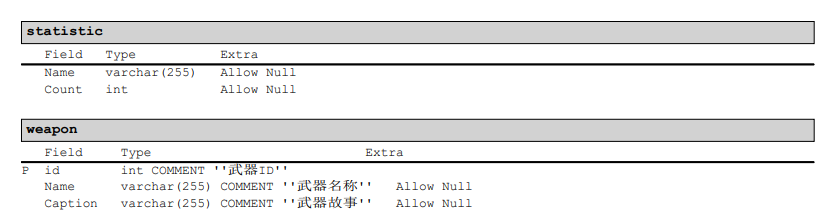
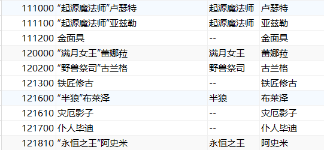
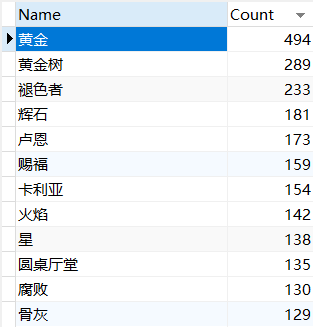

<h3>DataVisualize Lab 02</h3>

<h5>10192100571 俞辰杰</h5>

##### 		项目Github地址：https://github.com/PiKesi522/Data-Visualization_2022Spring/tree/main/Lab02

##### 		文本数据来源于Elden Ring v1.0.3的文本对话数据，经过MySQL预处理后得到需求的文本数据，处理过程位于MySQL文件夹中

##### 		词云方法参考：https://github.com/PiKesi522/js2wordcloud

### 一、数据预处理(MySQL)

- ​	MySQL进行预处理数据：

1. 首先根据初始文本的信息进行数据清理，根据物品名称，重复的内容将予以清空，清空过程如下所示：

   ~~~sql
   -- MergeSameProtector --
   -- 对于装备名称相同的项进行合并（其他表项类似） -- 
   WITH del As(
   	WITH keep AS(
   		SELECT protector.id
   		FROM protector
   		GROUP BY Caption
   	)
   	SELECT protector.id as tarid
   	FROM protector
   	LEFT JOIN keep
   		ON keep.id = protector.id
   	WHERE ISNULL(keep.id)
   )
   DELETE protector
   FROM protector, del
   WHERE protector.id = del.tarid
   ~~~

   

2. 对于npc的名称，部分存在着 ‘”代号“ + 姓名’ 的形式，所以要将npc的真实姓名提取出，得到结果如下

   ~~~sql
   With cons AS(
   	With tt AS(
   		With temp AS(
   			SELECT id, 
               	SUBSTRING_INDEX(`Name`,"”",1) as titleP, 
               	SUBSTRING_INDEX(`Name`,"”",-1) As RealNameP
   			FROM `npc`
   			WHERE `Name` like '%“%”%'
   		)
   		SELECT id, 
           	RIGHT(temp.titleP,CHAR_LENGTH(temp.titleP) - 1) AS titlePP, 
           	RealNameP
   		FROM temp
   	)
   	SELECT npc.id AS cid, 
       	IFNULL(titlePP, "--") AS Title, 
       	IFNULL(tt.RealNameP, npc.`Name`) AS RealName
   	FROM npc
   	LEFT JOIN tt
   		ON npc.id = tt.id
   )
   UPDATE npc
   JOIN cons
   	on npc.id = cons.cid
   SET npc.Title = cons.Title, npc.RealName = cons.RealName
   WHERE npc.id = cons.cid;
   ~~~

3. 对于对话文件，需要清除重复的文本

   ~~~sql
   CREATE DEFINER=`root`@`localhost` PROCEDURE `ProcessRepeatDialog`()
   BEGIN
   	DECLARE p_id INT;
   	DECLARE p_text VARCHAR(255);
   	DECLARE pointer CURSOR FOR(
   			SELECT *
   			FROM dialog D
   			GROUP BY D.id
   			ORDER BY D.id
   	);
   	DECLARE EXIT HANDLER FOR NOT FOUND CLOSE pointer;
   	
   	OPEN pointer;
   	REPEAT
   		FETCH pointer INTO p_id, p_text;
   		INSERT INTO processed_dialog VALUES(p_id, p_text);
   	UNTIL 0 END REPEAT;
   	CLOSE pointer;
   
   END
   ~~~

4. 上述数据处理完毕之后，准备需要统计的内容 ”Statistic“ 和 ”Source“

   ​	前者包括词频统计结果，后者包括需要搜索的源文件

   ~~~sql
   -- InitStatisticNPC --
   -- 将NPC得到的RealName导入Statistic（Place表同理） --
   CREATE DEFINER=`root`@`localhost` PROCEDURE `InitStatisticNPC`()
   BEGIN
   	DECLARE p_name VARCHAR(255);
   	DECLARE pointer CURSOR FOR(
   			SELECT RealName
   			FROM npc
   			ORDER BY RealName
   	);
   	DECLARE EXIT HANDLER FOR NOT FOUND CLOSE pointer;
   	
   	OPEN pointer;
   	REPEAT
   		FETCH pointer INTO p_name;
   		INSERT INTO statistic VALUES(p_name, 0);
   	UNTIL 0 END REPEAT;
   	CLOSE pointer;
   END
   ~~~

   ~~~sql
   -- InsertSourceDialogText --
   -- 将Dialog得到的预处理文本导入Source（其余表同理） --
   CREATE DEFINER=`root`@`localhost` PROCEDURE `InsertSourceDialogText`()
   BEGIN
   	DECLARE p_text VARCHAR(255);
   	DECLARE pointer CURSOR FOR(
   			SELECT text
   			FROM processed_dialog
   	);
   	DECLARE EXIT HANDLER FOR NOT FOUND CLOSE pointer;
   	
   	OPEN pointer;
   	REPEAT
   		FETCH pointer INTO p_text;
   		INSERT INTO source VALUES(p_text);
   	UNTIL 0 END REPEAT;
   	CLOSE pointer;
   END
   ~~~

5. 进行词频统计，在两个表之间使用双游标搜索。词频统计结果如下

   ~~~sql
   CREATE DEFINER=`root`@`localhost` PROCEDURE `CountStatisticFromSource`()
   BEGIN
   	DECLARE count INT;
   	DECLARE stopflag INT;
   	DECLARE ps1_name VARCHAR(255);
   	DECLARE ps2_text VARCHAR(255);
   	DECLARE pointerStatistic CURSOR FOR SELECT `Name` FROM statistic;
   	DECLARE pointerSource CURSOR FOR SELECT text FROM source;
   	DECLARE CONTINUE HANDLER FOR NOT FOUND SET stopflag = 1;
   	
   	SET stopflag = 0;
   	OPEN pointerStatistic;
   	STATISTIC_LOOP:LOOP
   		IF stopFlag = 1 THEN
   		    LEAVE STATISTIC_LOOP;
   		END IF;
   		SET count = 0;
   		FETCH pointerStatistic INTO ps1_name;
   		
   		OPEN pointerSource;
   		SOURCE_LOOP:LOOP
   			IF stopFlag = 1 THEN
   					LEAVE SOURCE_LOOP;
   			END IF;
   			FETCH pointerSource INTO ps2_text;
    			IF instr(ps2_text,ps1_name) > 0 THEN 
   				SET count = count + 1;
   			END IF;
   		END LOOP SOURCE_LOOP;
   		CLOSE pointerSource;
   		
   		SET stopflag = 0;
   		UPDATE statistic 
   		SET statistic.Count = count 
   		WHERE statistic.`Name` = ps1_name;
   		
   	END LOOP STATISTIC_LOOP;
   	CLOSE pointerStatistic;
   END
   ~~~

   

